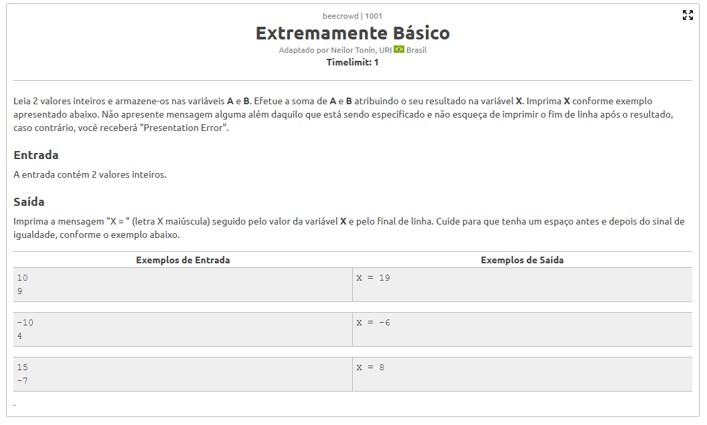
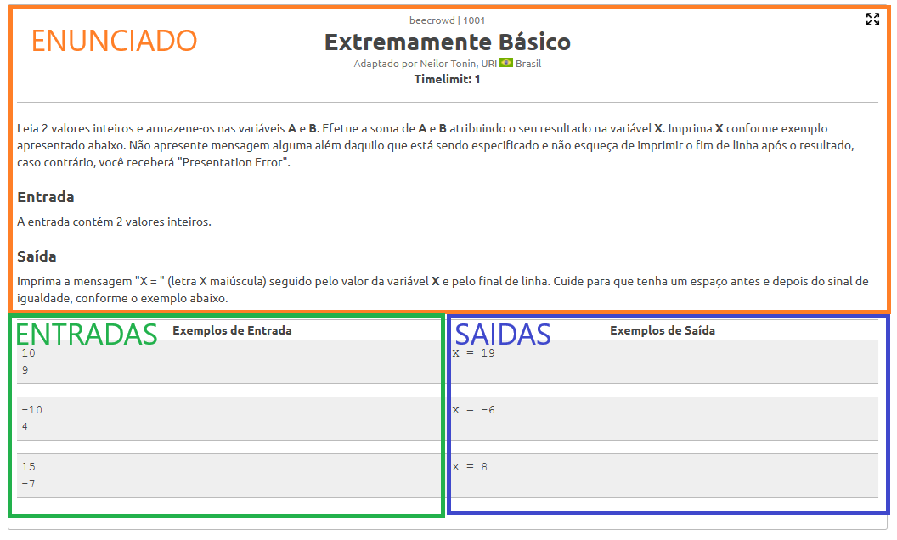

--- 
marp: true
size: 16:9
theme: gaia 
class: lead invert 
---

<!--
_class: lead invert gaia
-->
# <!--fit-->O que é a programação competitiva?
###### Porta de entrada nas grandes empresas

---

## A programação competitiva se trata da **resolução de problemas** aplicada em **exercicios de programação**.

---

## Ela então valoriza **criatividade, conhecimento, e habilidades técnicas** em sua essência.

---
<!--
_class: invert 
-->
## Geralmente, temos a **seguinte estrutura nos exercicios:**
* #### **Enunciado**: Onde vemos o objetivo da questão e seus detalhes;
* #### **Entrada**: Exemplos de entradas de dados, para termos o exercicios do enunciado ocorrendo com exemplos reais;
* #### **Saida**: Resposta proveniente da entrada prévia.

---

---

---

### Esse formato de exercício é constantemente **utilizado nas entrevistas das grandes empresas**, sendo muitas vezes critério **eliminatório**.

## Visto isso, seu aprendizado é imprescindível.

---
<!--
_class: lead invert gaia
-->
# <!--fit-->Quais são as grandes competições disso?
###### OBI e ICPC/SBC

---
<!--
_class: invert 
-->
# <!--fit--> A **OBI**, Olimpiada Brasileira de Informática:
* ### Só pode ser efetuada por alunos do primeiro ano da faculdade;
* ### É consideravelmente mais facil que a ICPC;
* ### Possibilidade real de ganhar.

---
<!--
_class: invert 
-->
# <!--fit--> A **ICPC**, International Collegiate Programming Contest
* ### É a **maior competição** de programação do mundo; 
* ### Possibilidade de **viagens internacionais** para competir, tudo gratis;
* ### Aumento gradual na dificuldade com a progressão das etapas;
* ### Mais dificil que a OBI, mas voce participa em **trio**.

---
<!--
_class: lead invert gaia
-->
# <!--fit-->Como vamos competir hoje?
###### Plataformas de treinamento como Beecrowd

---
### O **Beecrowd** é uma plataforma de treinamento que possibilita o **teste para perguntas** de competições passadas como OBI ou ICPC.

### Vamos **criar conta, logar nele e ver como funciona**.

---

# https://judge.beecrowd.com
